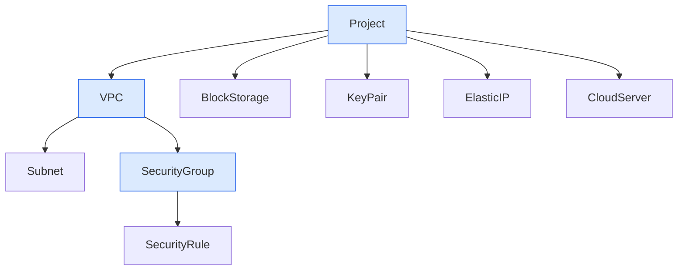
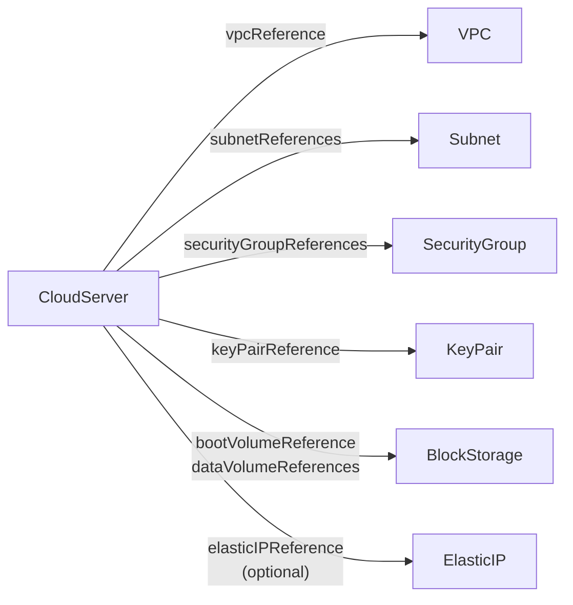
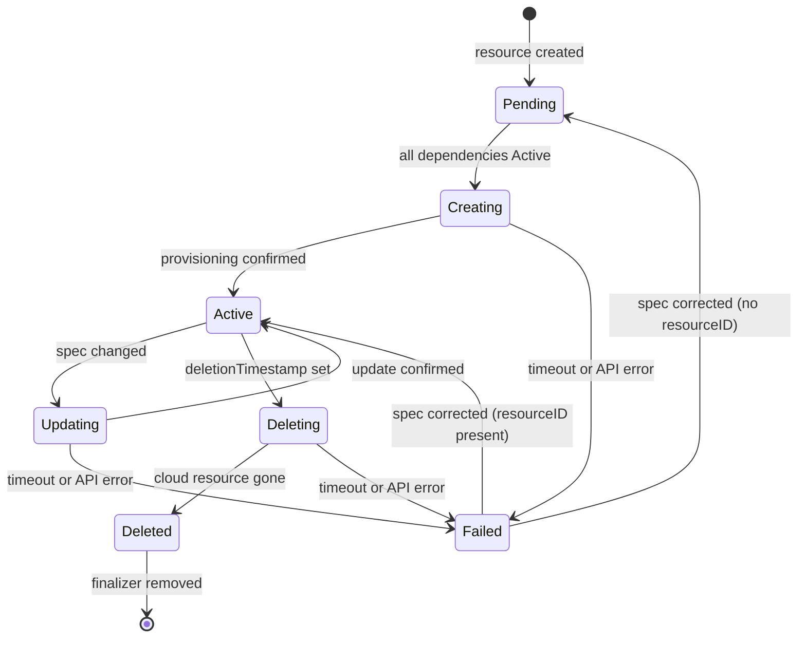

# Architecture

The Aruba Cloud Resource Operator is a Kubernetes operator that manages Aruba Cloud resources declaratively. You describe the desired state in Kubernetes Custom Resources (CRDs), and the operator continuously reconciles the cluster state with the Aruba Cloud API, creating, updating, or deleting resources as needed.

## Resource Ownership

Resources are organized in a parent–child hierarchy. Each child resource references its parent via a `spec.*Reference` field. When a parent is deleted, the operator automatically deletes all its children before removing the parent (cascade delete).



Arrows represent ownership: the child is deleted when its parent is deleted.

CloudServer is owned by Project, but it also *references* other resources when provisioned. Those use-references are shown below:



Deleting a referenced resource (VPC, Subnet, etc.) does **not** cascade to the CloudServer.

## Resource Lifecycle (Phases)

Every resource progresses through a series of phases as the operator synchronizes with the Aruba Cloud API. The current phase is always visible in `status.phase`.



**Transitory phases** (Creating, Updating, Deleting) have a maximum timeout of 10 minutes. If the operator cannot make progress within that time, the resource moves to **Failed**.

During **Creating**, the operator may internally cycle through `Provisioning` and `WaitingCondition` sub-states visible in `status.phase`. These reflect the Aruba Cloud platform's provisioning pipeline and require no action from you — the operator advances through them automatically.

**Failed** is a recoverable state. Once you correct the underlying issue (e.g., fix an invalid spec field or resolve a dependency), the operator will automatically retry and advance through the lifecycle.

## Conditions

In addition to `status.phase`, each resource exposes Kubernetes-standard conditions in `status.conditions`. The condition `type` is set to the current phase name, and the `reason` provides finer-grained information about what the operator is doing within that phase.

| Reason | Meaning |
|--------|---------|
| `ShallSynchronize` | The intent has been recorded; the operator has not yet dispatched a call to the Aruba Cloud API |
| `Synchronizing` | A call to the Aruba Cloud API has been dispatched; the operator is waiting for confirmation |
| `Synchronized` | The Aruba Cloud API has confirmed the desired state; the resource is stable |
| `Failed` | A timeout or API error has put the resource in a terminal error state |
| `ValidationFailed` | The Aruba Cloud API rejected the request with a validation error |
| `IntentionValidationFailed` | A conflict was detected between this resource's spec and its dependencies *before* calling the API (e.g., a tenant mismatch with the parent Project) |
| `PostValidationFailed` | A drift was detected between the live Aruba Cloud resource and its K8s dependencies *after* the resource was created |

## Cross-Resource References

Resources reference each other using `ResourceReference` objects:

```yaml
projectReference:
  name: my-project
  namespace: default
```

The `name` and `namespace` fields identify the Kubernetes object. The operator resolves the reference, reads the referenced object's `status.resourceID`, and uses that ID when calling the Aruba Cloud API.

References can point to objects in a different namespace (cross-namespace references are supported via a custom ownership model using annotations and labels instead of standard Kubernetes OwnerReferences, which are namespace-scoped).

**Cross-validation**: The operator validates that referenced resources are consistent with each other before provisioning. For example, a Subnet's `spec.tenant` must match its parent VPC's `spec.tenant`. A mismatch causes the resource to enter `Failed+IntentionValidationFailed` before any API call is made.

## Creation Ordering

Resources must be created in dependency order. A resource will stay in `Pending` until all its referenced parents are `Active`.

1. **Project** — must be created first
2. **VPC** — requires Project to be Active
3. **Subnet**, **SecurityGroup**, **BlockStorage**, **KeyPair**, **ElasticIP** — require their parents (VPC or Project) to be Active; these can be created in parallel
4. **SecurityRule** — requires SecurityGroup to be Active
5. **CloudServer** — requires all referenced resources (Project, VPC, Subnet, SecurityGroup, KeyPair, BlockStorage, optionally ElasticIP) to be Active

## Cascade Deletion

When you delete a parent resource, the operator:

1. Sets a `DeletionTimestamp` on all direct children (triggering their deletion)
2. Waits for all children to reach `Deleted` phase
3. Calls the Aruba Cloud API to delete the parent resource
4. Removes the finalizer, allowing Kubernetes to garbage collect the object

This means you can safely delete a Project and all its children (VPCs, BlockStorages, CloudServers, etc.) will be cleaned up automatically, in the correct order. The deletion may take several minutes for deeply nested hierarchies.

:::note
To delete all resources in a namespace, delete the Project. The operator will cascade-delete everything beneath it.
:::

## Authentication Modes

The operator supports two authentication modes, configured via the operator's ConfigMap:

- **Direct mode**: A single set of Aruba Cloud credentials is used for all resources. The `spec.tenant` field on each resource identifies which Aruba Cloud project/tenant to operate on.
- **Vault mode**: Credentials are retrieved per-tenant from HashiCorp Vault. Each unique `spec.tenant` value triggers a separate Vault lookup.

The `spec.tenant` field is intentionally mutable after creation (except on Project, where it is immutable). This allows you to correct a wrong tenant on a Failed resource without recreating it.
