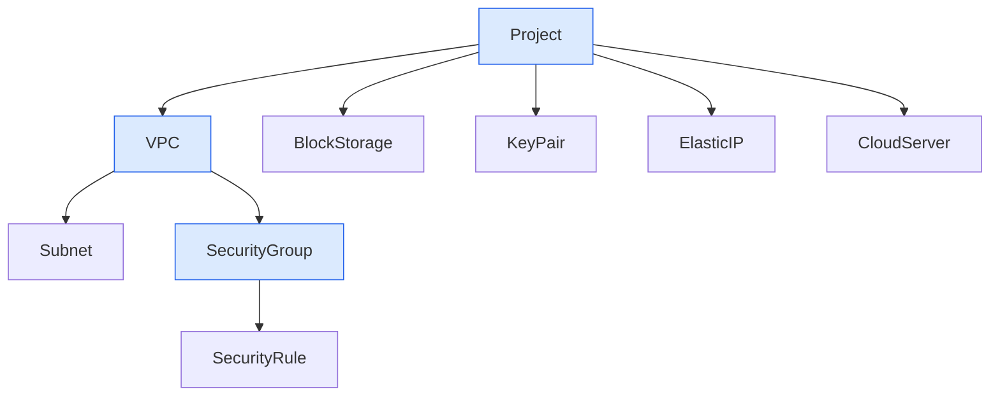
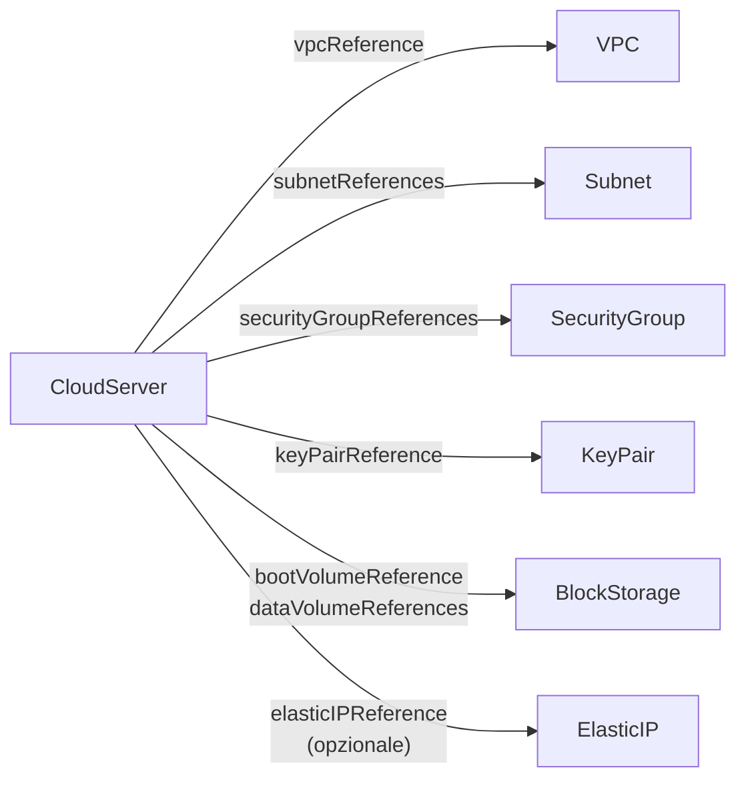
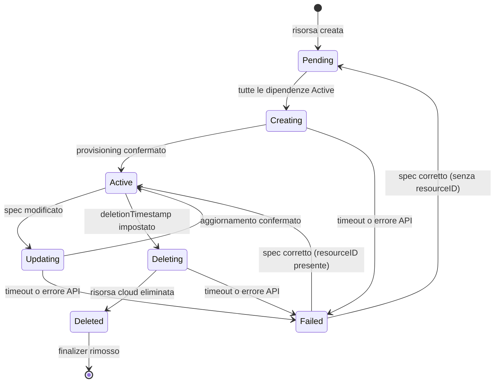

# Architettura

Aruba Cloud Resource Operator è un operatore Kubernetes che gestisce le risorse Aruba Cloud in modo dichiarativo. Descrivi lo stato desiderato in Custom Resources (CRD) Kubernetes e l'operatore riconcilia continuamente lo stato del cluster con l'API Aruba Cloud, creando, aggiornando o eliminando le risorse in base alle necessità.

## Gerarchia delle risorse

Le risorse sono organizzate in una gerarchia padre-figlio. Ogni risorsa figlio fa riferimento al suo genitore tramite un campo `spec.*Reference`. Quando un genitore viene eliminato, l'operatore elimina automaticamente tutti i suoi figli prima di rimuovere il genitore (eliminazione a cascata).



Le frecce rappresentano la proprietà: il figlio viene eliminato quando il genitore è eliminato.

CloudServer è di proprietà di Project, ma fa anche *riferimento* ad altre risorse quando viene provisionato. Queste relazioni d'uso sono mostrate di seguito:



L'eliminazione di una risorsa referenziata (VPC, Subnet, ecc.) **non** si propaga a cascata al CloudServer.

## Ciclo di vita delle risorse (Phase)

Ogni risorsa avanza attraverso una serie di fasi mentre l'operatore si sincronizza con l'API Aruba Cloud. La fase corrente è sempre visibile in `status.phase`.



Le **fasi transitorie** (Creating, Updating, Deleting) hanno un timeout massimo di 10 minuti. Se l'operatore non riesce a fare progressi entro quel tempo, la risorsa passa a **Failed**.

Durante **Creating**, l'operatore può internamente ciclare attraverso i sotto-stati `Provisioning` e `WaitingCondition` visibili in `status.phase`. Questi riflettono la pipeline di provisioning della piattaforma Aruba Cloud e non richiedono alcuna azione da parte tua — l'operatore vi avanza automaticamente.

**Failed** è uno stato recuperabile. Una volta corretto il problema sottostante (ad esempio, correggendo un campo spec non valido o risolvendo una dipendenza), l'operatore riproverà automaticamente e avanzerà nel ciclo di vita.

## Condizioni

Oltre a `status.phase`, ogni risorsa espone condizioni standard Kubernetes in `status.conditions`. Il `type` della condizione è impostato sul nome della fase corrente, mentre il `reason` fornisce informazioni più dettagliate su cosa sta facendo l'operatore in quella fase.

| Reason | Significato |
|--------|-------------|
| `ShallSynchronize` | L'intento è stato registrato; l'operatore non ha ancora inviato una chiamata all'API Aruba Cloud |
| `Synchronizing` | Una chiamata all'API Aruba Cloud è stata inviata; l'operatore è in attesa di conferma |
| `Synchronized` | L'API Aruba Cloud ha confermato lo stato desiderato; la risorsa è stabile |
| `Failed` | Un timeout o un errore API ha messo la risorsa in uno stato di errore terminale |
| `ValidationFailed` | L'API Aruba Cloud ha rifiutato la richiesta con un errore di validazione |
| `IntentionValidationFailed` | È stato rilevato un conflitto tra lo spec di questa risorsa e le sue dipendenze *prima* di chiamare l'API (es. un mismatch di tenant con il Project genitore) |
| `PostValidationFailed` | È stato rilevato un drift tra la risorsa Aruba Cloud live e le sue dipendenze K8s *dopo* la creazione della risorsa |

## Riferimenti tra risorse

Le risorse si riferiscono l'una all'altra usando oggetti `ResourceReference`:

```yaml
projectReference:
  name: my-project
  namespace: default
```

I campi `name` e `namespace` identificano l'oggetto Kubernetes. L'operatore risolve il riferimento, legge `status.resourceID` dell'oggetto referenziato e usa quell'ID quando chiama l'API Aruba Cloud.

I riferimenti possono puntare a oggetti in un namespace diverso (i riferimenti cross-namespace sono supportati tramite un modello di proprietà personalizzato che usa annotazioni ed etichette anziché i OwnerReferences standard di Kubernetes, che sono limitati al namespace).

**Validazione incrociata**: L'operatore verifica che le risorse referenziate siano coerenti tra loro prima del provisioning. Ad esempio, il `spec.tenant` di una Subnet deve corrispondere al `spec.tenant` del VPC genitore. Un mismatch porta la risorsa a `Failed+IntentionValidationFailed` prima che venga effettuata qualsiasi chiamata API.

## Ordine di creazione

Le risorse devono essere create nell'ordine delle dipendenze. Una risorsa rimarrà in `Pending` finché tutti i suoi genitori referenziati non saranno `Active`.

1. **Project** — deve essere creato per primo
2. **VPC** — richiede che il Project sia Active
3. **Subnet**, **SecurityGroup**, **BlockStorage**, **KeyPair**, **ElasticIP** — richiedono che i loro genitori (VPC o Project) siano Active; questi possono essere creati in parallelo
4. **SecurityRule** — richiede che il SecurityGroup sia Active
5. **CloudServer** — richiede che tutte le risorse referenziate (Project, VPC, Subnet, SecurityGroup, KeyPair, BlockStorage, opzionalmente ElasticIP) siano Active

## Eliminazione a cascata

Quando elimini una risorsa genitore, l'operatore:

1. Imposta un `DeletionTimestamp` su tutti i figli diretti (attivando la loro eliminazione)
2. Attende che tutti i figli raggiungano la fase `Deleted`
3. Chiama l'API Aruba Cloud per eliminare la risorsa genitore
4. Rimuove il finalizer, consentendo a Kubernetes di fare il garbage collect dell'oggetto

Questo significa che puoi eliminare in modo sicuro un Project e tutti i suoi figli (VPC, BlockStorage, CloudServer, ecc.) verranno puliti automaticamente, nell'ordine corretto. L'eliminazione può richiedere diversi minuti per gerarchie profondamente annidate.

:::note
Per eliminare tutte le risorse in un namespace, elimina il Project. L'operatore cascaderà l'eliminazione di tutto ciò che si trova al di sotto.
:::

## Modalità di autenticazione

L'operatore supporta due modalità di autenticazione, configurate tramite la ConfigMap dell'operatore:

- **Modalità diretta**: un singolo set di credenziali Aruba Cloud viene utilizzato per tutte le risorse. Il campo `spec.tenant` su ciascuna risorsa identifica su quale progetto/tenant Aruba Cloud operare.
- **Modalità Vault**: le credenziali vengono recuperate per tenant da HashiCorp Vault. Ogni valore univoco di `spec.tenant` attiva una ricerca Vault separata.

Il campo `spec.tenant` è intenzionalmente mutabile dopo la creazione (eccetto su Project, dove è immutabile). Questo ti consente di correggere un tenant errato su una risorsa in stato Failed senza ricrearla.
